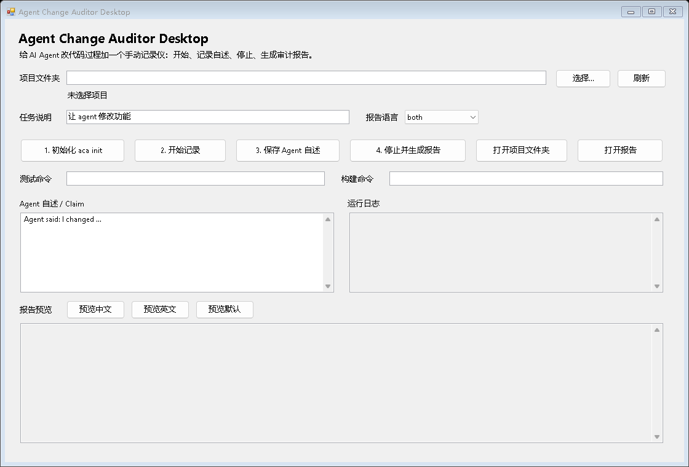

# Agent Change Auditor Desktop Prototype

Windows 桌面原型，用按钮包装全局 `aca` 命令。



## 启动

双击：

```text
Start-AgentChangeAuditorDesktop.cmd
```

或在 PowerShell 里运行：

```powershell
powershell.exe -NoProfile -ExecutionPolicy Bypass -File .\AgentChangeAuditorDesktop.ps1
```

## 使用流程

1. 选择项目文件夹。
2. 如果项目不是 git 仓库，点 `1. 初始化 aca init`。
3. 填写任务说明，点 `2. 开始记录`。
4. 让 agent 修改代码。
5. 粘贴 agent 自述，点 `3. 保存 Agent 自述`。
6. 填写可选测试/构建命令，点 `4. 停止并生成报告`。
7. 在下方预览或打开中英文报告。

## 说明

这是第一版桌面外壳，不重写核心逻辑。真正的审计仍由
`agent-change-auditor` CLI 完成。

## 当前能力

- 一键选择要审计的本地项目。
- 一键初始化审计环境。
- 手动开始 / 手动停止审计窗口。
- 保存 Agent 对自己改动的描述，用于和真实 `git diff` 对比。
- 可填写测试命令、构建命令，报告会记录执行结果。
- 支持预览中文、英文、默认报告。

## 依赖

需要先能在命令行运行：

```powershell
aca --help
```

本机已经通过 `npm link` 安装了全局 `aca`，所以通常直接双击启动器即可。

## 生成预览图

```powershell
powershell.exe -NoProfile -ExecutionPolicy Bypass -File .\AgentChangeAuditorDesktop.ps1 -ScreenshotPath .\preview.png
```
